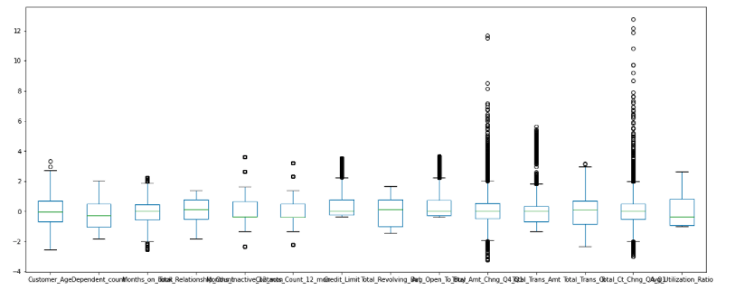
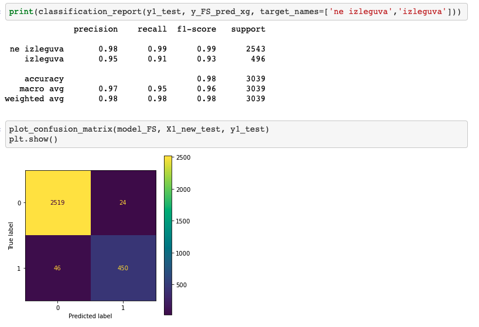
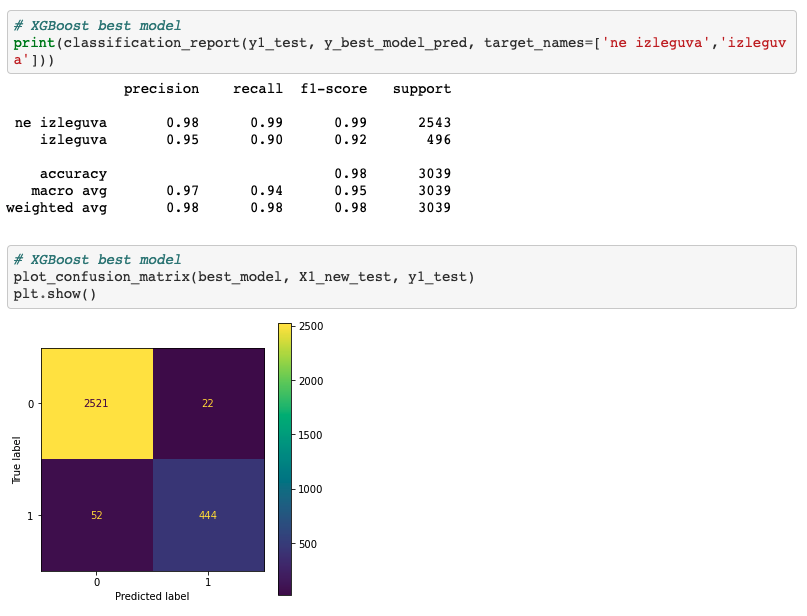

# Bank churn prediction
This is a project for churn prediction written in **Python** and *Scikit-Learn* 
Aquiring new customers is very costly for the companies so they tend to closely follow churn rate. 
The full cost of churn includes both lost revenue and the marketing costs involved with replacing those customers with new ones.
That is why churn rate prediction has become important part of the business of the companies.
Due to the direct effect on the revenues of the companies, companies are seeking to develop means to predict potential customer to churn since predicting and preventing customer churn represents a huge additional potential revenue source for every business.
The model developed in this work uses machine learning techniques that are explained in more depth, bellow.


> Scikit-learn is a free software machine learning library for the Python programming language. It features various classification, regression and clustering algorithms including support vector machines
## Team Structure

#### supreme court of the galactic republic
  **Kiril Cevtkov** - "Master Yoda"

#### 
1. Goran Stojanovski Team leader - "Obi Wan Kenobi"
2. Vladimir Vuksanovic           - "luke skywalker"
3. Goran Puntevski  - "Han Solo"
4. Petar Trajchevski  - "R2 D2" (Specialist in Pasta)
5. Dashmir Ibishi  - "C-3PO" (internet / language protocol specialist)
---

## Project Specification
The following ML techniques were used in this project
- EDA
  - basic statistics/ visualization 
Future division by types (numerical/ categorical) + basic statistics
```
df_num = df.select_dtypes(include = ['float64', 'int64'])
df_cat = df.select_dtypes(include = ['object'])
df_num.describe()
df_num.plot(kind='box',subplots = True, figsize=(20,8), fontsize = 7, sharex = False)
```

- Data preprocessing
  - normalization/ missing data/ categorical data

Structure of futures
```
a = df_num.Customer_Age.value_counts(bins = 10)
b = df_num.Dependent_count.value_counts()
c = df_num.Months_on_book.value_counts(bins = 10)
d = df_num.Total_Relationship_Count.value_counts()
e = df_num.Months_Inactive_12_mon.value_counts(sort = True, bins = 10)
f = df_num.Contacts_Count_12_mon.value_counts(bins = 10)
g = df_num.Credit_Limit.value_counts(bins = 10)
h = df_num.Total_Revolving_Bal.value_counts(bins = 10)
i = df_num.Avg_Open_To_Buy.value_counts(bins = 10)
j = df_num.Total_Amt_Chng_Q4_Q1.value_counts(bins = 10)
k = df_num.Total_Trans_Amt.value_counts(bins = 10)
l = df_num.Total_Trans_Ct.value_counts(bins = 10)
m = df_num.Total_Ct_Chng_Q4_Q1.value_counts(bins = 10)
n = df_num.Avg_Utilization_Ratio.value_counts(bins = 10)

a, b, c, d, e, f, g, h, i, j, k, l, m, n
```
checking of NaN values
```
df_num.isna().sum()
```

Visualisation of future: "Months_on_book"
```
plot=sns.countplot(x='Months_on_book', data=df_num)
plt.xticks(rotation=45)
plt.show()
```
Replacing outlayers with NaN
```
df_num['Months_on_book']=df_num.Months_on_book.replace({-2147483647.0:np.nan,
                                                       2147483647.0:np.nan,
                                                       3.21000000e+11:np.nan})
```
- Feature Anaysis, Extraction & Selection

Reshape of futures "Months_on_book" : following code snippet :
```
mob_imputer = SimpleImputer(missing_values = np.NaN, strategy = 'mean') # go definirame Simple imputer, stratgegijata = mean
df_num.Months_on_book = mob_imputer.fit_transform(df_num['Months_on_book'].values.reshape(-1,1))[:,0]
```

For features with outlayers we used Robust Scaler with the following code snippet :
```
from sklearn import preprocessing
from sklearn.preprocessing import RobustScaler # za varijablite so outleeri

robscal = RobustScaler()
columnsO = ['Months_on_book','Credit_Limit', 'Avg_Open_To_Buy', 'Total_Amt_Chng_Q4_Q1', 'Total_Trans_Amt', 'Total_Ct_Chng_Q4_Q1']
    
df_num_rs[columnsO] = robscal.fit_transform(df_num_rs[columnsO])
```

For features without outlayers we used Standard Scaler with the following code snippet :
```
from sklearn.preprocessing import StandardScaler 
standscal = StandardScaler()

columnsNO = ['Customer_Age', 'Dependent_count', 'Total_Relationship_Count', 'Months_Inactive_12_mon', 'Contacts_Count_12_mon',
            'Total_Revolving_Bal', 'Total_Trans_Ct', 'Avg_Utilization_Ratio']

df_num_rs[columnsNO] = standscal.fit_transform(df_num_rs[columnsNO])
```
Screenshot of visualisation of scaled features: 
<p align = "center">

</p>

CatBoost encoding of categorical data
```

y1 = target.copy()
df_cat_cb = df_cat.copy()

import category_encoders as ce

cat_columns = ['Gender', 'Education_Level', 'Marital_Status', 'Income_Category','Card_Category']
catBoostEncoder = ce.CatBoostEncoder(cols=cat_columns)
df_cat_cb = catBoostEncoder.fit_transform(df_cat_cb, y1)
```
One hot encoding check
```
from sklearn.preprocessing import OneHotEncoder

transformer2 = OneHotEncoder(sparse=False) 
one_hot_encoder = transformer2.fit_transform(df_cat_ohe)
df_cat_ohe = pd.concat([df_cat_ohe, pd.DataFrame(one_hot_encoder)], axis='columns')
```
CatBoost encoder shows better results- it is used for feature selection
```
from sklearn.feature_selection import SelectKBest, f_classif

selector = SelectKBest(f_classif, k=14)
selector_fit = selector.fit(X1_train, y1_train)
dfscores = pd.DataFrame(selector_fit.scores_)
dfcolumns = pd.DataFrame(X1_train.columns) 
featureScores = pd.concat([dfcolumns,dfscores], axis=1)
featureScores.columns = ['Specs','Score']  
print(featureScores.nlargest(14,'Score'))  
```

- Classification models 
Following classifiers were used: Decision tree, Random Forest, KNN, XGboost
Those models were applied over CatBoost encoded dataset

Application of Random Forest classifiers gave best result with Cat Boost encoded data set
  - Random Forest
```
from sklearn.ensemble import RandomForestClassifier

rfCB = RandomForestClassifier(random_state = 42)
rfCB.fit(X1_train,y1_train)
y_pred_cb_rf = rfCB.predict(X1_test)
rfCBscore = accuracy_score(y1_test, y_pred_cb_rf)
rfCBscore
```
Screenshot of classification report and confusion matrix for Random Forest
<p align = "center">

</p>


  - XG-Boost
Additionaly XGBoost was applied, and best results were obtained in comparison with other classifiers
The best resulst were obtained by appling XGBoost on CatBoost encoded features selection data set
```
import xgboost as xgb
from xgboost import XGBClassifier

model_FS = XGBClassifier()
model_FS.fit(X1_new_train,y1_train)

y_FS_pred_xg = model_FS.predict(X1_new_test)
```
Screenshot of classification report and confusion matrix for XGBoost classifier
<p align = "center">

</p>

- Evaluation and comparisons, metrics

```
ax = plt.gca()
plot_xboost = plot_roc_curve(model_new, XGB_test,  y1_test, ax=ax)

ax = plt.gca()
plot_fs = plot_roc_curve(model_FS, X1_new_test, y1_test, ax=ax)

plt.show()
```

- Hyperparameter Optimization
XGBoost model was futher fine tuned by using "Grid search" hyperparameter optimization
```
from sklearn.model_selection import RandomizedSearchCV, GridSearchCV
from sklearn.model_selection import StratifiedKFold
from sklearn.model_selection import KFold

kf = KFold(n_splits=5, shuffle=True)
print(type(kf))
params = {
        'min_child_weight': [1, 5, 10],
        'gamma': [0.5, 1, 1.5, 2, 5],
        'learning_rate': [0.1, 0.15, 0.2, 0.25],
        'subsample': [0.6, 0.8, 1.0],
        'colsample_bytree': [0.6, 0.8, 1.0],
        'max_depth': [3, 4, 5]
        }
model = GridSearchCV(estimator = model_FS, 
                     param_grid = params,
                     scoring = 'roc_auc',
                     cv = kf,
                     verbose = 5,
                    n_jobs = -1
                    )
model.fit(X1_new_train,y1_train)

print("Best model: ", model.best_estimator_)
print("Best Parameters: ", model.best_params_)
print("Best score ", model.best_score_ * 100.0)


best_model = XGBClassifier(colsample_bytree=0.6,gamma=0.5, learning_rate=0.15, max_depth=5, min_child_weight=1, 
                           subsample=1)
best_model.fit(X1_new_train,y1_train)
```

- Final evaluations and comparisons

Screenshot of best model classification report and confusion matrix (XGBoost classifier after Grid search hyperparameter optimization)
<p align = "center">

</p>


## Installation
```
import pandas as pd   
import numpy as np    
import matplotlib.pyplot as plt 
import seaborn as sns 

import warnings
warnings.filterwarnings('ignore')
%matplotlib inline

!pip install scikit-learn

import sklearn
from sklearn.impute import SimpleImputer


from sklearn import preprocessing
from sklearn.preprocessing import RobustScaler

from sklearn.preprocessing import StandardScaler 
standscal = StandardScaler()
from sklearn.preprocessing import OneHotEncoder

import category_encoders as ce

from sklearn.feature_selection import SelectKBest, f_classif

from sklearn.model_selection import train_test_split
from sklearn.metrics import classification_report
from sklearn.ensemble import RandomForestClassifier

!pip install xgboost

import xgboost as xgb
from xgboost import XGBClassifier
`
from sklearn.metrics import plot_roc_curve

from sklearn.model_selection import RandomizedSearchCV, GridSearchCV
from sklearn.model_selection import StratifiedKFold
from sklearn.model_selection import KFold
```


## Dataset

To download the dataset please click [HERE](documention/dataset_bank.csv)

## 

## May the Force be with you
