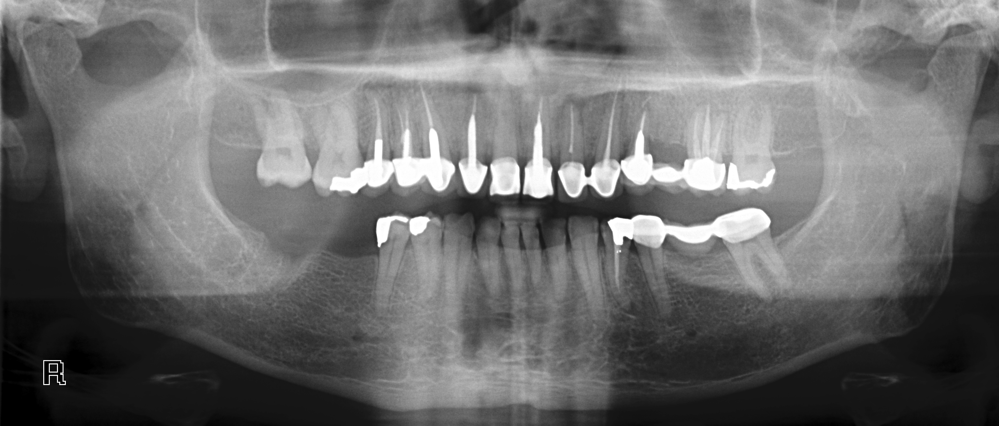

# Bank churn prediction
This is a project for churn prediction written in **Python** and *Scikit-Learn* 


> Scikit-learn is a free software machine learning library for the Python programming language. It features various classification, regression and clustering algorithms including support vector machines
## Team Structure

#### supreme court of the galactic republic
  **Kiril Cevtkov** - "Master Yoda"

#### 
1. Goran Stojanovski Team leader - "Obi Wan Kenobi"
2. Vladimir Vuksanovic           - "luke skywalker"
3. Goran Puntevski  - "Han Solo"
4. Petar Trajchevski  - "R2 D2" (Specialist in Pasta)
5. Dashmir Ibishi  - "C-3PO" (internet / language protocol specialist)
---

| Video1 | Video2| Video3| ne koristime nikakvi videa- ova e proba za edite direktno vo GitHub
| ---- | ------ |-----------|
|[![Training][results]](https://www.youtube.com/watch?v=2b2LPtljqdA)|[![Training][slika1]](https://www.youtube.com/watch?v=2b2LPtljqdA)|[![Training][slika1]](https://www.youtube.com/watch?v=2b2LPtljqdA)|
## Project Specification
The following ML techniques wer used in this project
- EDA
  - basic statistics/ visualization 
Future division by types (numerical/ categorical) + basic statistics
```
df_num = df.select_dtypes(include = ['float64', 'int64'])
df_cat = df.select_dtypes(include = ['object'])
df_num.describe()
df_num.plot(kind='box',subplots = True, figsize=(20,8), fontsize = 7, sharex = False)
```

- Data preprocessing
  - normalization/ missing data/ categorical data

Structure of futures
```
a = df_num.Customer_Age.value_counts(bins = 10)
b = df_num.Dependent_count.value_counts()
c = df_num.Months_on_book.value_counts(bins = 10)
d = df_num.Total_Relationship_Count.value_counts()
e = df_num.Months_Inactive_12_mon.value_counts(sort = True, bins = 10)
f = df_num.Contacts_Count_12_mon.value_counts(bins = 10)
g = df_num.Credit_Limit.value_counts(bins = 10)
h = df_num.Total_Revolving_Bal.value_counts(bins = 10)
i = df_num.Avg_Open_To_Buy.value_counts(bins = 10)
j = df_num.Total_Amt_Chng_Q4_Q1.value_counts(bins = 10)
k = df_num.Total_Trans_Amt.value_counts(bins = 10)
l = df_num.Total_Trans_Ct.value_counts(bins = 10)
m = df_num.Total_Ct_Chng_Q4_Q1.value_counts(bins = 10)
n = df_num.Avg_Utilization_Ratio.value_counts(bins = 10)

a, b, c, d, e, f, g, h, i, j, k, l, m, n
```
checking of NaN values
```
df_num.isna().sum()
```

Visualisation of future: "Months_on_book"
```
plot=sns.countplot(x='Months_on_book', data=df_num)
plt.xticks(rotation=45)
plt.show()
```
Replacing outlayers with NaN
```
df_num['Months_on_book']=df_num.Months_on_book.replace({-2147483647.0:np.nan,
                                                       2147483647.0:np.nan,
                                                       3.21000000e+11:np.nan})
```
- Feature Anaysis, Extraction & Selection

Reshape of futures "Months_on_book" : following code snippet :
```
mob_imputer = SimpleImputer(missing_values = np.NaN, strategy = 'mean') # go definirame Simple imputer, stratgegijata = mean
df_num.Months_on_book = mob_imputer.fit_transform(df_num['Months_on_book'].values.reshape(-1,1))[:,0]
```

For futures with outlayers we used Robust Scaler with the following code snippet :
```
from sklearn import preprocessing
from sklearn.preprocessing import RobustScaler # za varijablite so outleeri

robscal = RobustScaler()
columnsO = ['Months_on_book','Credit_Limit', 'Avg_Open_To_Buy', 'Total_Amt_Chng_Q4_Q1', 'Total_Trans_Amt', 'Total_Ct_Chng_Q4_Q1']
    
df_num_rs[columnsO] = robscal.fit_transform(df_num_rs[columnsO])
```

For futures without outlayers we used Standard Scaler with the following code snippet :
```
from sklearn.preprocessing import StandardScaler 
standscal = StandardScaler()

columnsNO = ['Customer_Age', 'Dependent_count', 'Total_Relationship_Count', 'Months_Inactive_12_mon', 'Contacts_Count_12_mon',
            'Total_Revolving_Bal', 'Total_Trans_Ct', 'Avg_Utilization_Ratio']

df_num_rs[columnsNO] = standscal.fit_transform(df_num_rs[columnsNO])
```
Screenshot of visualisation of scaled features: 
<p align = "center">

</p>

CatBoost enocoding of categorical data
```

y1 = target.copy()
df_cat_cb = df_cat.copy()

import category_encoders as ce

cat_columns = ['Gender', 'Education_Level', 'Marital_Status', 'Income_Category','Card_Category']
catBoostEncoder = ce.CatBoostEncoder(cols=cat_columns)
df_cat_cb = catBoostEncoder.fit_transform(df_cat_cb, y1)
```
One hot encoding check
```
from sklearn.preprocessing import OneHotEncoder

transformer2 = OneHotEncoder(sparse=False) 
one_hot_encoder = transformer2.fit_transform(df_cat_ohe)
df_cat_ohe = pd.concat([df_cat_ohe, pd.DataFrame(one_hot_encoder)], axis='columns')
```
CatBoost encoder shows better results- it is used for feature selection
```
from sklearn.feature_selection import SelectKBest, f_classif

selector = SelectKBest(f_classif, k=14)
selector_fit = selector.fit(X1_train, y1_train)
dfscores = pd.DataFrame(selector_fit.scores_)
dfcolumns = pd.DataFrame(X1_train.columns) 
featureScores = pd.concat([dfcolumns,dfscores], axis=1)
featureScores.columns = ['Specs','Score']  
print(featureScores.nlargest(14,'Score'))  
```

- Classification models 
Following classifiers were used: Decision tree, Random Forest, KNN, XGboost
Those models were apply ower CatBoost encoded dataset
  - Decision tree 
```

```
  - Random Forest
  - KNN
  - XG-Boost
- Evaluation and comparisons, metrics
- Hyperparameter Optimization
- Final evaluations and comparisons
- Discussion, Concusions, Future improvements

For training Random forest we used the following code snippet :

```

```


## Installation
For installing scikit-learn please do :
import sklearn
from sklearn.impute import SimpleImputer


from sklearn import preprocessing
from sklearn.preprocessing import RobustScaler

from sklearn.preprocessing import StandardScaler 
standscal = StandardScaler()
from sklearn.preprocessing import OneHotEncoder

import category_encoders as ce

from sklearn.feature_selection import SelectKBest, f_classif

pip install scikit-learn
`


## Dataset

For download the dataset please click [HERE](http://google.com)

Screenshot of training performance : 


<p align = "center">

</p>

![Training][xray]

<p align = "center">

</p>


## Evalauation results

| Test | Traing | Validation|
| ---- | ------ |-----------|
| 99% | 92% |91%     |


## Fixed bugs :
- ~~Failure in installation because of ...~~
- ~~Improved model performance~~
- ~~Fixed bug in sort algorithm~~

## We tried the following Deep Learning Pretrained models:
- [x] Resnet50
- [ ] VGG16
- [ ] Densenet
